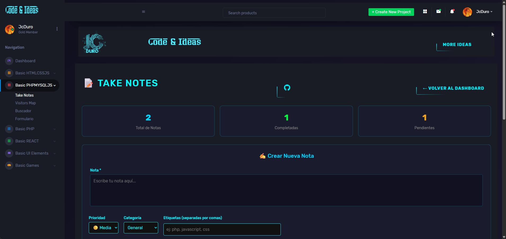

## 📒 Módulo de Notas

Pequeño módulo del **dashboard** JcDuro para gestionar notas de forma rápida y centralizada, pensado como herramienta interna para registrar, consultar y actualizar información de notas desde una interfaz web sencilla.

## 📚 Índice

- [Descripción](#-descripción)
- [Características](#-características)
- [Tecnologías](#-tecnologías)
- [Estructura del proyecto](#-estructura-del-proyecto)
- [Instalación y uso](#-instalación-y-uso)


## 📝 Descripción

<p align="center">
  Este módulo forma parte del JcDuro DashBoard y permite gestionar notas desde la web,
integrándose con el resto de componentes del panel de administración.</i>.
</p>

El objetivo es ofrecer una interfaz ligera para:
- Registrar nuevas notas.
- Listar y filtrar notas existentes.
- Editar o eliminar registros según permisos.

---

## 🖼️ Vista previa



--- 

## 🚀 Demo
[Take_Notes](https://jcduro.bexartideas.com/proyectos/dashjc/notas/notas.php)

## 📊 Lenguajes y Herramientas

[](https://skillicons.dev)

--- 

## 🛠 Características

- CRUD completo de notas (crear, leer, actualizar, eliminar).
- Búsqueda y filtrado básico por campos clave.
- Interfaz responsive integrada al tema general del dashboard.
- Validación básica de formularios en frontend.
- Mensajes de feedback para acciones (éxito/error).

--- 

## 💻 Tecnologías

- PHP (procedural / MVC ligero) para la lógica de negocio.
- MySQL / MariaDB para el almacenamiento de notas.
- HTML5 y CSS3 para la estructura y estilos.
- Bootstrap (o tu framework CSS) para el layout responsive.
- JavaScript (Vanilla/jQuery si aplica) para interacciones en la UI.

--- 

## 💻 Estructura de la BD para la tabla `notasjc`

```bash
CREATE TABLE `notasjc` (
  `cod_nota` int(11) NOT NULL,
  `nota` text NOT NULL,
  `prioridad` enum('baja','media','alta') DEFAULT 'media',
  `categoria` varchar(50) DEFAULT 'general',
  `etiquetas` varchar(255) DEFAULT NULL,
  `completada` tinyint(1) DEFAULT 0,
  `fecha_creacion` timestamp NULL DEFAULT current_timestamp(),
  `fecha_actualizacion` timestamp NULL DEFAULT current_timestamp() ON UPDATE current_timestamp()
) ENGINE=InnoDB DEFAULT CHARSET=utf8mb4 COLLATE=utf8mb4_unicode_ci;
```
---

## 🗂 Estructura del proyecto

```bash
proyectos/dashjc/
 └── notas/
     ├── notas.php          # Página principal del módulo
     ├── includes/
     │   ├── conexion.php   # Conexión a la base de datos
     └── assets/
         ├── css/ notas.css
```
---

## 🗂 instalación y uso

Los ejemplos de plantillas README suelen incluir screenshots y pasos de uso básicos.[3]

```md

## 🚀 Instalación y uso

1. Clonar o copiar el módulo dentro de `notas/`.
2. Configurar la conexión a la base de datos en `includes/conexion.php`.
3. Importar el script SQL con la tabla de notas (ej. `notasjc.sql`).
4. Enlazar la ruta `notas/notas.php` dentro del menú del dashboard.
5. Acceder desde el navegador a la ruta configurada del dashboard.

### Requisitos

- PHP 7.x o superior.
- Servidor web (Apache / Nginx).
- MySQL / MariaDB.

```
---

## 📌 To‑Do

- Mejorar filtros avanzados (por fecha, usuario, categoría).
- Añadir paginación en el listado.
- Implementar sistema de permisos por rol.
- Agregar exportación de notas (CSV / PDF).

---

Proyecto desarrollado por **JcDuro DashBoard**.


